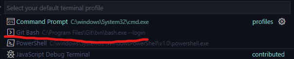

# Installation av miljö för MongoDb

Det finns flera olika sätt att jobba med MongoDB, denna guiden visar både det som måste installeras oavsett vilken terminal eller IDE man väljer att använda men också ett mycket bra alternativ till utvecklingsmiljö.

## Installera MongoDB Community Server

1. Tryck på denna länken: [MongoDB Community Server installer](https://www.mongodb.com/try/download/community) och installera MongoDB Community server.
2. Installera sedan [MongoDB Shell](https://www.mongodb.com/try/download/shell)

## Installera GitBash (Om man inte redan har det.)

Öppna startmenyn och sök på: Git Bash. Om det inte kommer upp så installera från länken nedan: 
[Git install](https://git-scm.com/download/win)

## Installera Visual Studio Code (VSC)

1. Installera [Visual Studio Code](https://code.visualstudio.com/)
2. VSC är en IDE för många olika typer av språk och projekt. Vi kommer att använda detta i Webb-kursen.
3. Välj GitBash som default shell i den interna terminalen
   1. 
   2. 
   3.  
4. Installera Extension för MongoDB:
   1. 
   2. 
   
## Testa så allt är igång

* Du bör nu se denna loggan till vänster i Visual Studio Code: 
  * **Om inte, starta om VSC**
* När du trycker på den bör du se detta: 
  * Tryck på lövet för att connecta: 
  * **Om du inte ser detta, starta om datorn**
* Starta MongoDB Shell. 
* Du bör nu se detta: 
  * **Om inte, starta om VSC och datorn om det behövs.**

## Efter installation: 

Titta på och följ med i denna tutorial: [MongoDB Crash Course](https://www.youtube.com/watch?v=ofme2o29ngU)

## Dokummentation:

* [CheatSheet](Dark.pdf)
* [MongoDb Docs](https://docs.mongodb.com/manual/tutorial/getting-started/)
* [w3Schools JSON](https://www.w3schools.com/js/js_json_intro.asp)
